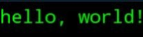

هo-world!
Create your first program in Python

# Description
This is a very simple program whose function is to print "hello world." It is considered the first code for all programmers.

# Screenshot 
The program's output will be as shown in the image.

# Link:
https://github.com/abdualhali792/hello-world

# My GitHub account
https://github.com/abdualhali792/
